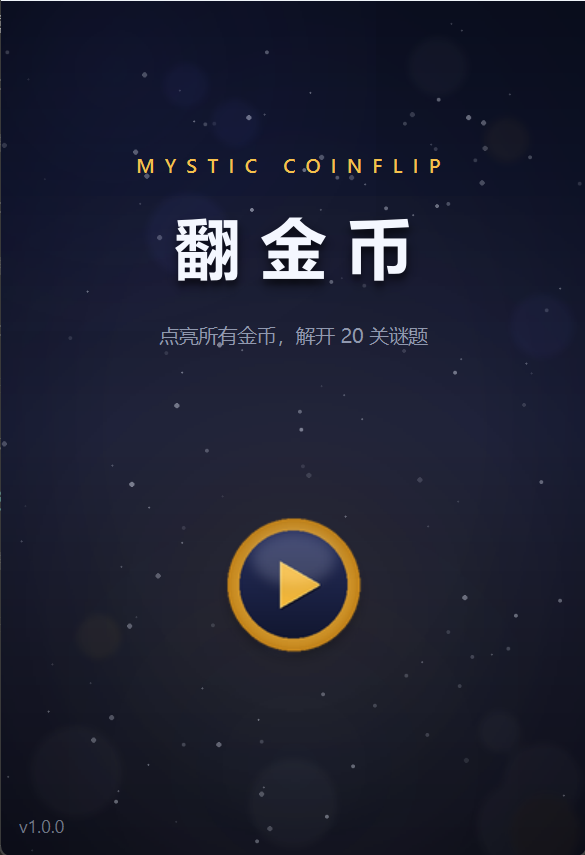
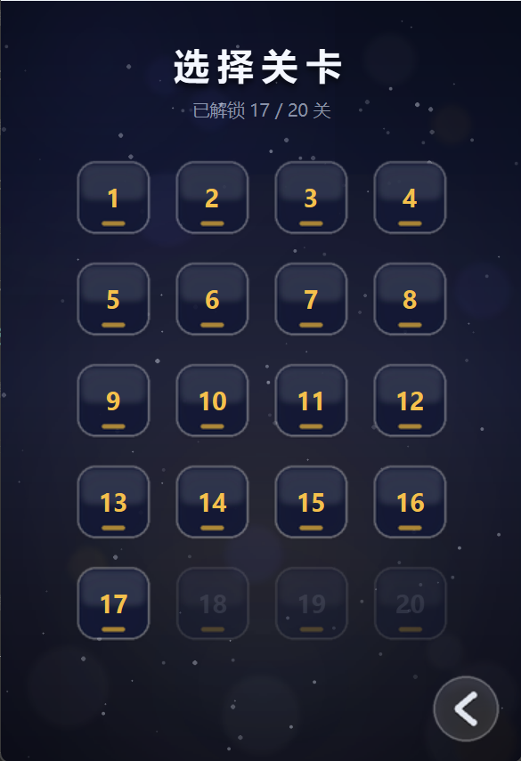
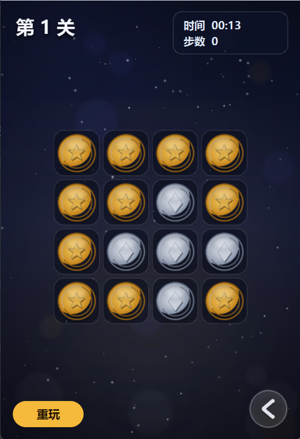

# 翻金币 · Mystic CoinFlip

经典「翻金币」益智小游戏（[BV1g4411H78N](https://www.bilibili.com/video/BV1g4411H78N) 教程项目的现代化重制版），基于 **Qt 6 / C++17**。

点击一枚金币时，它会与上下左右相邻的金币一起翻转；将棋盘全部翻成金币正面即通关。共 **20 关**，难度递增。

## 界面预览

| 主菜单 | 选择关卡 | 游戏中 |
|---|---|---|
|  |  |  |

## 功能特性

- 🎮 **单窗口架构**：主菜单 / 选关 / 游戏三个页面平滑淡入淡出切换，无窗口闪烁
- 🎨 **统一视觉体系**：深空靛蓝 + 琥珀金的现代暗色风格，全部素材由脚本程序化生成（见下文）
- 🔒 **顺序解锁**：通关当前关卡后自动解锁下一关，进度持久化（注册表）
- 🏆 **最佳成绩**：记录每关最快用时与最少步数，破纪录时结算面板给出提示；选关按钮悬停可查看最佳成绩
- ✨ **动效**：金币 8 帧翻转动效 + 点击回弹、棋盘波浪式入场、通关横幅弹跳落下、按钮悬停缩放、主菜单按钮待机浮动
- 🔊 **音效**：按钮、翻转、通关四种音效统一管理
- ⌨️ **快捷键**：`Esc` 返回选关，`F5` 重玩本关
- 🪟 **安装即用**：Windows 版本信息与应用图标，免安装绿色版发布包

## 程序化素材管线

`resource/` 下的全部图片素材（背景、金币 8 帧翻转动画、按钮、关卡徽章、应用图标）均由
[scripts/generate_assets.py](scripts/generate_assets.py) 以 2x 分辨率程序化生成，保证整套 UI 共用同一色板与光影语言：

```bash
python scripts/generate_assets.py   # 需要 Pillow
```

调整配色或造型参数后重新运行即可整体换肤。

## 运行 & 构建

### 直接游玩

前往 [Releases](https://github.com/Su2uka/CoinFlip/releases) 下载最新的 `CoinFlip-vX.X.X-windows-x64.zip`，解压后运行 `CoinFlip.exe`。

### 从源码构建

要求：CMake ≥ 3.21、Qt ≥ 6.5（含 Multimedia 模块）

```bash
cmake -S . -B build -DCMAKE_PREFIX_PATH=<Qt安装路径> -DCMAKE_BUILD_TYPE=Release
cmake --build build --config Release
```

Windows 下如需发布包，可对构建产物执行：

```bash
windeployqt --release --dir dist build/CoinFlip.exe
```

## 自动打包发布

仓库内置 GitHub Actions 工作流（[`.github/workflows/release.yml`](.github/workflows/release.yml)）：

- 推送 `v*` 标签（如 `v1.1.0`）时自动构建 Windows x64 版本并创建 Release、附上压缩包
- 手动触发（workflow_dispatch）时只构建并上传 artifact

发布新版本只需：

```bash
git tag v1.1.0
git push origin v1.1.0
```

## License

仅供学习交流使用。
